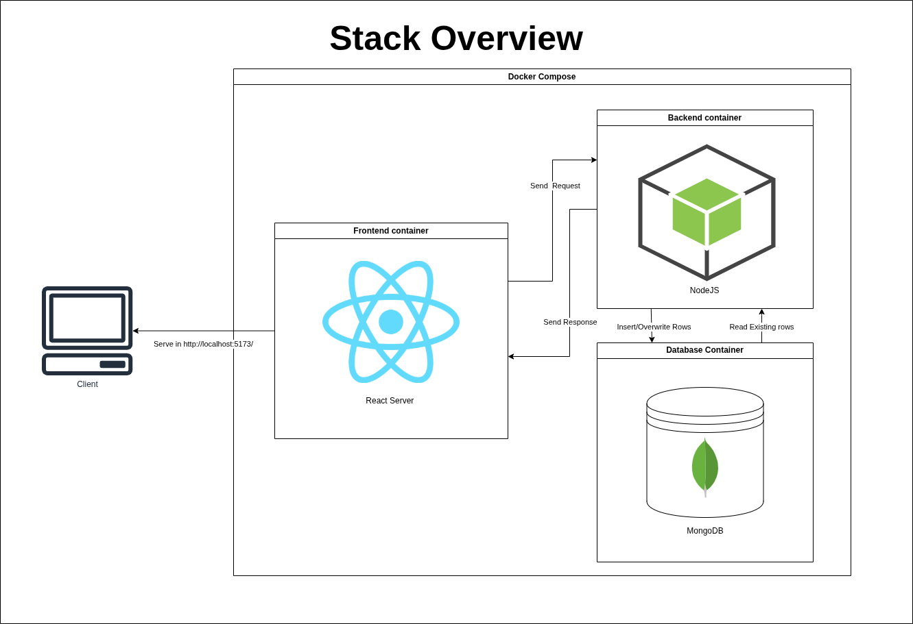
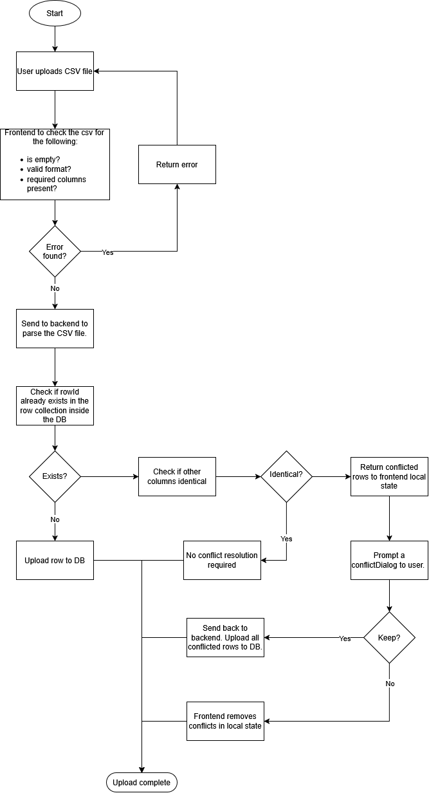

# Technical Assessment
## Overview 
- This full stack web application is created using the MERN stack, which includes MongoDB, ExpressJS, React, and NodeJS.
- The goal is to create a full stack web application that allows user to upload a CSV file, complete with data validation and error handling, to store into a database. Users should also be able to search and upload new data with real time updates between users.
## Justification
- The assigned task required me to use React as my frontend, and NodeJS for my backend. 
- The assignment did not specify a Database to use so I went and used MongoDB because I have used it before in the past.
- My table component listens to the server for any broadcasted rowChanges sent to all client sockets which will refresh the table if it occurs. This is implemented to achieve a responsive and collaborative interaction.
## Assumptions
- The dataset contains data of comments from a post (e.g Facebook, Reddit, X Post comments)
- id column is the unique identfier of this dataset.
- postID is the unique identifier of a post. Where there can be many comments in 1 post. 


## Prerequisites

- [Docker](https://docs.docker.com/get-docker/) and Docker Compose — to run the full stack (frontend, backend, MongoDB).
- Node.js and npm — only needed if you want to run the backend/frontend outside Docker, or run the unit test suites.

## How to Run

### With Docker (recommended)

From the project root (containing the docker-compose.yml file):
```bash
docker compose up -d --build
```

This builds and starts three containers:

| Service  | URL/PORT                |
|----------|-------------------------|
| frontend | http://localhost:5173   |
| backend  | http://localhost:5000   |
| mongo    | port 27017              |

To stop the docker compose contianers:
```bash
docker compose down
```


### Running the unit tests

```bash
cd backend
npm install
npm test            

cd frontend
npm install
npm test           
```

## Tech Stack



## Database Schema

One collection, `rows`, backing the `Row` model:

```
Row {
  _id: ObjectId          — Mongo's own id, auto-generated
  rowId: Number, unique  — the CSV's original "id" column value
  postId: Number
  name: String
  email: String
  body: String
  createdAt: Date        — auto (timestamps)
  updatedAt: Date        — auto (timestamps)
}
```

There is no second collection. Conflicts detected during a CSV upload are never persisted to the database — they exist only as JSON traveling between the browser and the server for the duration of one review.

## Conflict Resolution Flow


